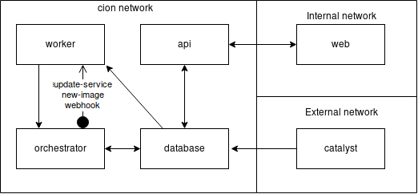

# Cion
The cion solution is composed of 5 main microservices communicating with a database. Each service runs in one of the 3 following networks.

|Network|Specification|
|---|---|
|External|Must be accessible by the image hosts(dockerhub/docker registry)|
|Internal|Must be accessible by the users of the cion web interface|
|cion|Internally used network.|

*The black arrows shows direction of data flow.*

# web
[read the docs](http://docs.cionkubes.com/projects/web)
[dockerhub](https://hub.docker.com/r/cion/web)
[github](https://github.com/cionkubes/cion-web)
# api
[read the docs](http://docs.cionkubes.com/projects/api)
[dockerhub](https://hub.docker.com/r/cion/api)
[github](https://github.com/cionkubes/cion-api)
# worker
[read the docs](http://docs.cionkubes.com/projects/worker)
[dockerhub](https://hub.docker.com/r/cion/worker)
[github](https://github.com/cionkubes/cion-worker)
# orchestrator
[read the docs](http://docs.cionkubes.com/projects/orchestrator)
[dockerhub](https://hub.docker.com/r/cion/orchestrator)
[github](https://github.com/cionkubes/cion-orchestrator)
# catalyst
[read the docs](http://docs.cionkubes.com/projects/catalyst)
[dockerhub](https://hub.docker.com/r/cion/catalyst)
[github](https://github.com/cionkubes/cion-catalyst)