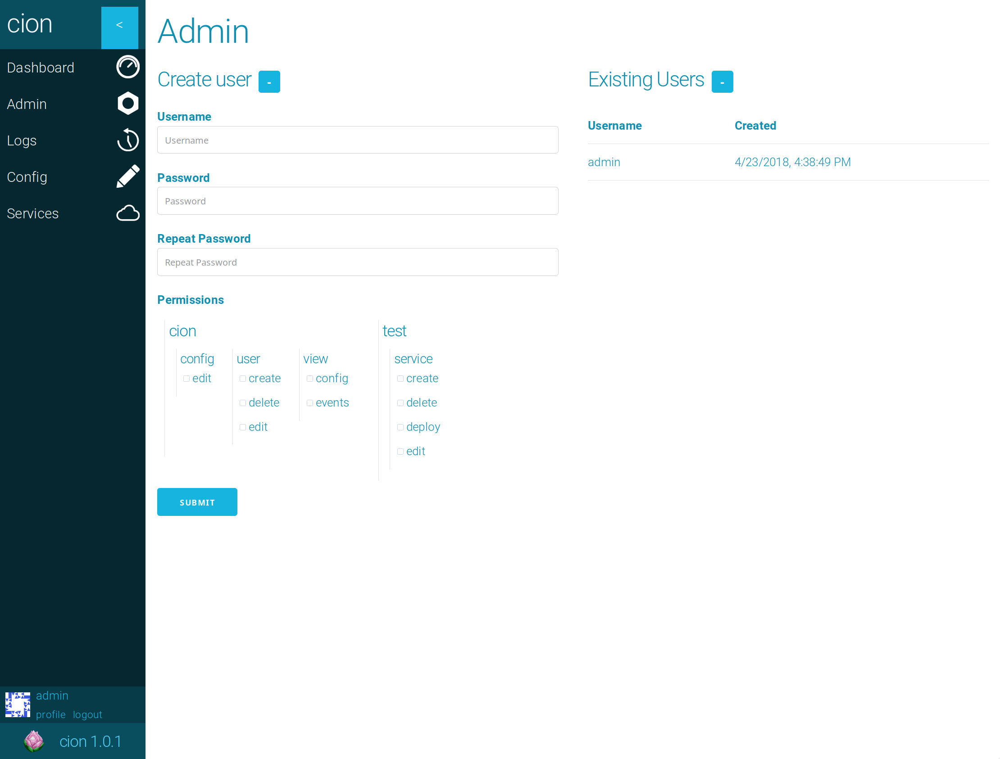
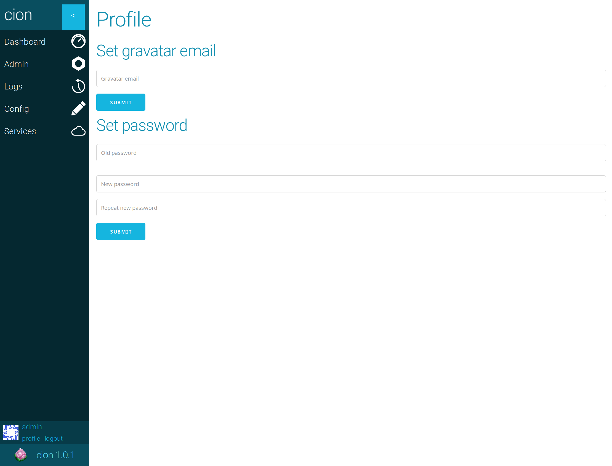
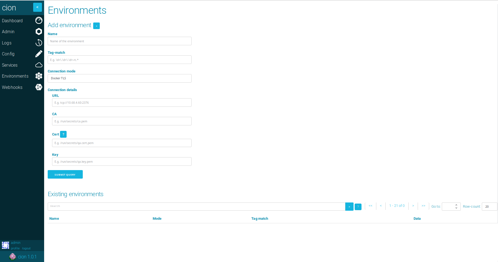
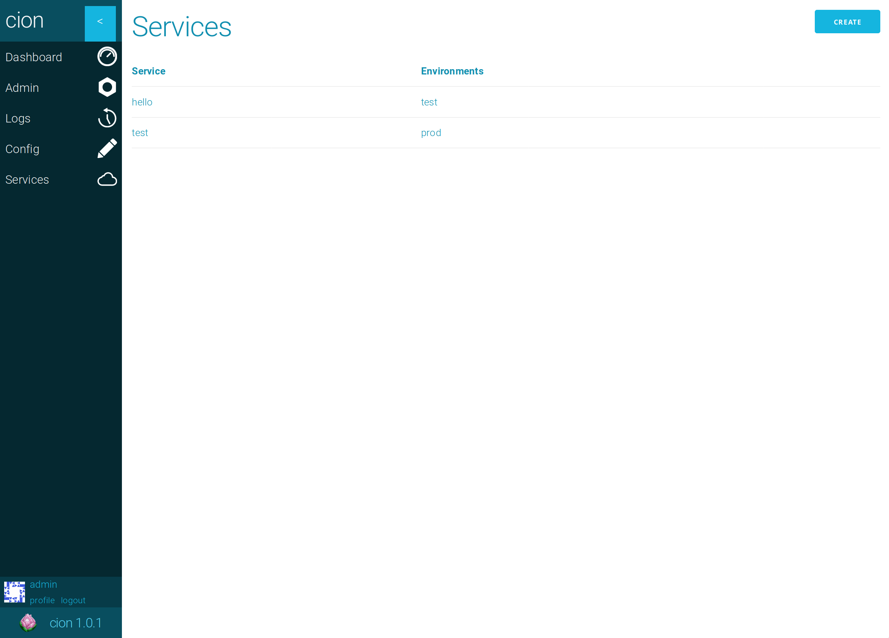

# Configuring cion

The cion web interface primarily exists to aid in configuring the automatic deployment of images to services in either docker swarm or kubernetes. Some experimental features may be configurable in a online text editor while a UI is developed for the feature.

### External webhooks
In order for cion to know about new images uploaded to docker image hosts, external webhooks must be configured in the image hosts.

#### Dockerhub
Firsly you will need admin-access to the repository you are adding the webhook to. If you are the owner you will already have this.

Go to the repository page and click `Webhooks`. This will bring you to a new page. Then click the `+` icon next to `WEB HOOKS`.

Enter a descriptive name for your webhook, e.g. 'cion', and the url for the cion-catalyst service. This is probably something like `yourdoman.org/cion-catalyst/dockerhub/<URL_TOKEN>` or `cion.yourdomain.org/dockerhub/<URL_TOKEN>`. This varies according to your setup, as in how you have exposed the catalyst service. `URL_TOKEN` will the token you created in the [step where you generated your secrets](secrets.md#token).

### User management
When cion starts for the first time a admin user will be created with the username and password **admin**, it's necessary to change this password *immediately*.

Navigate to the admin page from the menu on the left. You should see a list of existing users. Click on a user open the user settings for that user.


#### Changing password
To change a users password navigate to the users settings, here you should see a form where you can input the new password.

#### Changing permissions
To change a users permissions navigate to the users settings, here you should see a series of checkboxes for each available permission.

#### Deleteing a user
To delete a user navigate to the users settings, here you should see a delete button at the top right of the page.

#### Creating a user
To create a user navigate to the admin page, here you should see a page with a form for creating a new user.

### Profile
You can access your own profile by clicking on the *profile* link at the bottom left. Here you can change your own password and set a email account used for your gravatar profile image.


### Environment

Navigate to the environments page from the menu on the left. You should see ....


#### Creating a new environment
To create a new environment navigate to the environments page, here you should see a form for creating a environment. The form consists of the following fields.

|Field|Description|
|---|---|
|Name|The name of the service, e.g. **qa**|
|Tag-Match|A regex, when new images are pushed the new image's tags must match in order for the images to be deployed to services running in this environment.|
|Connection mode|Choose one of the connection modes detailed below.|

##### Docker TLS
This connection mode allows you to securely connect to a remote docker environment over TLS. Click here for [help](secrets.md#docker) with setting up the secrets. You will need to fill out the following extra fields.

|Field|Description|
|---|---|
|URL|The remote environment's URL, e.g. **tcp://10.68.4.60:2376**|
|CA|The file with the certificate authority, e.g. **/run/secrets/qa.ca.pem**|
|Certificate|Client's certificate, e.g. **/run/secrets/qa.cert.pem**|
|Key|Client's key, e.g. **/run/secrets/qa.key.pem**|

##### Kubernetes service account
This connection mode allows you to securely connect to a remote kubernetes environment over with a service account. Click here for [help](secrets.md#kubernetes) with setting up the secrets. You will need to fill out the following extra fields.

|Field|Description|
|---|---|
|URL|The remote environment's URL, e.g. ****|
|CA|The file with the certificate authority, e.g. **/run/secrets/qa.ca.pem**|
|Certificate|Client's certificate, e.g. **/run/secrets/qa.cert.pem**|
|Key|Client's key, e.g. **/run/secrets/qa.key.pem**|

##### Docker socket
This connection mode allows you to connect to a local docker environment through the docker socket. This mode will connect through */var/run/docker.sock*

### Service
Navigate to the services page from the menu on the left. You should see a list of existing services and a button for creating new services.


#### Creating a new service
To create a service navigate to the services page, here you should see the `create` button in the top right. The form has the three following fields.

|Field|Description|
|---|---|
|Service Name|This field corresponds with the name of the service running in your environments as show by docker service ls, if a service is running in a kubernetes environment the name should correspond with the deployment name.|
|Environments|Select the list of environments where cion should look for services matching the name field.|
|Image name|This field should identify the image you wish to update the found services with, the format is: `[repo]/[image]` e.g. `cion/web` (NB tags should not be specified here, it is up the the individual environments to accept or reject tags)|

### Repositories

Navigate to the config page from the menu on the left. You can configure repositories in the textbox titled `repos`.

The config is a json structure consisting of a list of docker image host `users`. A `user` consists of the following properties.

##### User

|Field|Optional|Description|
|---|---|---|
|user|No|The image host username|
|repos|Yes|A list of repo objects described below|
|default_login|Yes|If a repository that is not in the `repos` object is accesses this default value will be used for all repositories under this user|
|default_glob|Yes|If a repository that is not in the `repos` object is accesses this default value will be used for all repositories under this user|

##### Repo

|Field|Optional|Description|
|---|---|---|
|repo|No|The name of the repository|
|login|Yes|A string pointing to a json file with credentials for logging in to `[user]/[repo]`|
|glob|Yes, default is `(.*)/(.*):(.*)`|A regex used for parsing incoming images, there should be three groups in the regex. The first group matches the user, the second group matches the repo, and the third group matches the tag. These matches are used i.e. when a environment accepts or rejects a tag.|

### Internal webhooks

Cion can trigger webhooks to other services when certain events occurr within cion. The currently supported event-types are:
* service-update: this event triggers when cion updates the image of a service
* new-image: triggers when cion recieves a notification that a new image exists

The following fields configure your webhook. Longer descriptions are below this list.

* URL: the target URL of the webhook
* Headers: HTTP-headers to include in the request
* Event: what event to trigger on (service-update/new-image)
* Filters/triggers: regex-patterns to match on the event data. If one of these fail the webhook-request is not sent
* Body: the body of the webhook request

#### Filters

This is a list of name/value pairs. The name is the name of the field in the event data. What fields are contained in the event data varies per event-type. 

The `new-image`-event contains these fields:
* image-name: name of the image received
* event: what type of event. `new-image`
* status: what status this task has. Possible values are: ready, processing, done and erroneous
* time: epoch time of when the event was recieved or last updated

The `service-update`-event contains these fields:
* service: name of the service to update
* image-name: name of the image to update the specified services with
* environment: what environment to update the service with the specified service-name
* status: what status this task has. Possible values are: ready, processing, done and erroneous
* event: what type of event. `service-update`
* time: epoch time of when the event was recieved or last updated

What cion does when a new event occurrs is go through all the filters of every webhooks that is configured to fire on that specific event. It will go through each webhook and run a `match` with the regex pattern contained in the `value` on the `name` matching a field in the event data.

An example with the event data:
```JSON
{
  "service": "cion_api",
  "image-name": "cion/api:1.0.0"
}
```

and the filters:
```JSON
{
  "image-name": "^cion\/api:\d.\d.\d$"
}
```

In this case the filter would pass because the regex pattern defined for the field `image-name` is `^cion\/api:\d.\d.\d$`, and that matches the input string `cion/api:1.0.0`.

But if the event data was:
```JSON
{
  "service": "cion_api",
  "image-name": "cion/api:2.0.0-rc"
}
```

-the webhook would not be fired, because the defined pattern does not match the field `image-name` from the event data (`cion/api:2.0.0-rc`).

#### Body
The \textbf{body} is the body of the HTTP-request to send to the configured URL. It supports the python format-function. So the user can insert fields from the event data into the body by using curly brackets around field-names in the text. For example:

```python
{{
  "service-name": "{service}"
}}
````

The above example generates a JSON-body containing exactly one key-value-pair, containing the service-name extracted from the event data. 
The user has to escape curly brackets, as shown above, due to how python's format-function tries to interpret them as variable-names.
The above body-string would result in the following when the field "service" in the event data is "cion_api":

```JSON
{
  "service-name": "cion_api"
}
```

This example used JSON as the content type, but any string and formatting is supported. 
